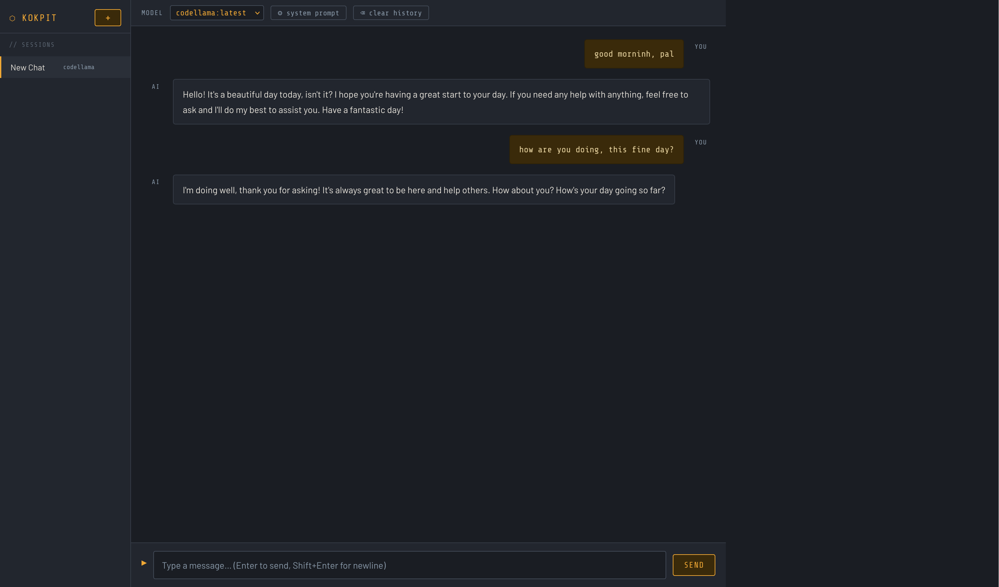

# ⬡ Kokpit

A personal offline AI chat desktop app built with FastAPI, React, and Tauri.  
Runs fully offline using [Ollama](https://ollama.com) — no internet required after setup.



## Stack

| Layer | Technology |
|-------|-----------|
| Desktop shell | Tauri 2 (Rust) |
| Frontend | React + Vite |
| Backend | FastAPI (Python) |
| AI runtime | Ollama |
| Storage | SQLite (via aiosqlite) |
| Markdown | marked.js |
| Syntax highlighting | highlight.js |

## Features

- 💬 **Multi-session chat** — create, rename, delete sessions
- 🤖 **Model switching** — switch between any locally pulled Ollama model per session
- ⚙️ **System prompt** — customize the AI persona per session
- 📝 **Markdown rendering** — AI responses render with full markdown support
- 🎨 **Syntax highlighting** — code blocks highlighted automatically
- 📋 **Copy button** — one-click copy on every code block
- 💾 **Persistent history** — all sessions and messages stored in SQLite
- ✈️ **Fully offline** — works on a plane, in a bunker, anywhere

## Requirements

- macOS (Apple Silicon recommended)
- [Rust](https://rustup.rs)
- [Node.js](https://nodejs.org) 18+
- [Python](https://python.org) 3.12+
- [Ollama](https://ollama.com)

## Setup

### 1. Clone

```zsh
git clone git@github.com:kofadam/kokpit.git
cd kokpit
```

### 2. Pull Ollama models

```zsh
ollama pull llama3.2
ollama pull codellama
```

### 3. Backend

```zsh
python3.12 -m venv venv
source venv/bin/activate
pip install fastapi uvicorn httpx aiosqlite
```

### 4. Frontend

```zsh
cd frontend
npm install
```

## Running (dev mode)

You need three things running:

**Terminal 1 — Ollama:**
```zsh
ollama serve
```

**Terminal 2 — Backend:**
```zsh
source venv/bin/activate
cd backend
uvicorn main:app --reload
```

**Terminal 3 — Frontend:**
```zsh
cd frontend
npm run dev
```

Then open http://localhost:5173

## Project Structure

```
kokpit/
├── backend/
│   ├── main.py        # FastAPI routes
│   ├── database.py    # SQLite / session + message storage
│   ├── ollama.py      # Ollama streaming client
│   └── models.py      # Pydantic data models
├── frontend/
│   └── src/
│       ├── App.jsx
│       ├── App.css
│       ├── api.js     # all fetch calls to backend
│       └── components/
│           ├── Sidebar.jsx       # session list
│           ├── ChatWindow.jsx    # message bubbles + markdown
│           ├── SessionConfig.jsx # model picker + system prompt
│           └── MessageInput.jsx  # text input + send
└── src-tauri/         # Tauri desktop shell
```

## Roadmap

- [ ] Tauri build — package as a native `.app`
- [ ] Auto-start backend from Tauri
- [ ] Export chat as markdown
- [ ] Search across sessions
- [ ] Token count display
